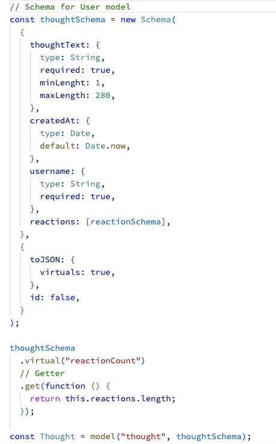

# Social Network API

## Description 

The Social Network API is a RESTful API that serves as the backend for a social network application. It provides a set of endpoints to manage users, thoughts, reactions, and friendships. 

The API is built using Node.js, Express.js, and MongoDB, offering a reliable and scalable solution for handling social network functionalities.

## Table of Contents (Optional)

If your README is very long, add a table of contents to make it easy for users to find what they need.

* [Installation](#installation)
* [Usage](#usage)
* [Demo](#demo-video)
* [Technologies Used](#technologies-used)
* [Credits](#credits)
* [License](#license)

## Installation

To set up the Social Network API locally, follow the steps below:

* Clone the repository:
    
        git clone https://github.com/Kaidenparcher/Social-Network-API.git

* Install the dependencies:

        cd Social-Network-API
        npm install

* Set up the seeds by running:

        npm run seed

* Start the server:

        !npm start

## Usage 

1. Install and open Insomnia.
2. Create a new workspace.
3. Create a new request and set the method, URL, and headers.
4. Send the request and view the response.
5. Use the API endpoints to manage users, thoughts, reactions, and friendships.
6. Set the appropriate method and URL for each operation (e.g., GET, POST, PUT, DELETE).
7. Provide the necessary request body or parameters.
8. Send the request and view the response to perform actions such as creating users, retrieving thoughts, adding reactions, etc.
9. Explore and test different endpoints to utilize the features of the Social-Network-API.
10. Repeat the process to perform various operations and interact with the API efficiently.

Here is a code snippet of the User Routes to show how the insomina actions should be formatted:

Here is a code snippet of the Thoughts model to show how mongoDB syntax works:

## Demo Video

Click on the link below for a demo video:

[https://www.youtube.com/watch?v=qx1YsOXqoJU](https://www.youtube.com/watch?v=qx1YsOXqoJU)

## Technologies Used

The Social-Network-API is built using the following technologies:

* Node.js: A JavaScript runtime environment that allows executing JavaScript code on the server-side. It provides an event-driven, non-blocking I/O model for building scalable and high-performance applications.

* Express.js: A web application framework for Node.js that simplifies the process of building robust APIs. It provides features like routing, middleware support, and easy integration with other libraries.

* MongoDB: A popular NoSQL database that provides a flexible and scalable solution for storing and retrieving data. It stores data in a JSON-like format called BSON and offers high performance for read and write operations.

* Mongoose: An Object Data Modeling (ODM) library for Node.js and MongoDB. It provides a convenient way to define data models, perform database operations, and establish relationships between collections.

## Credits

This Project was built by Kaiden Parcher.
For more information visit my Github [https://github.com/Kaidenparcher](https://github.com/Kaidenparcher)

## License

This application was built using the Open Sourse MIT license. For more information visit [https://opensource.org/license/mit/](https://opensource.org/license/mit/)

